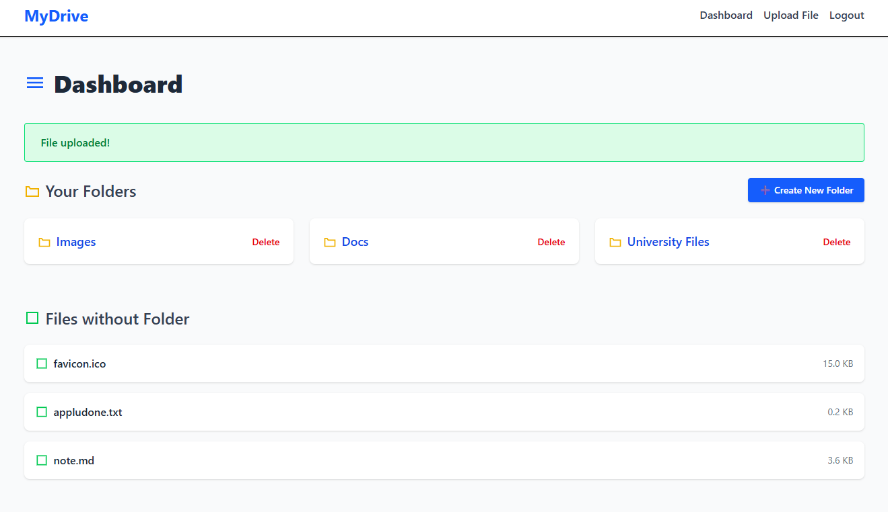
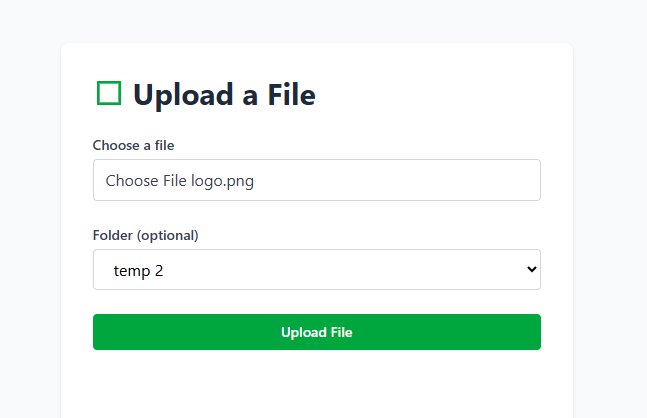
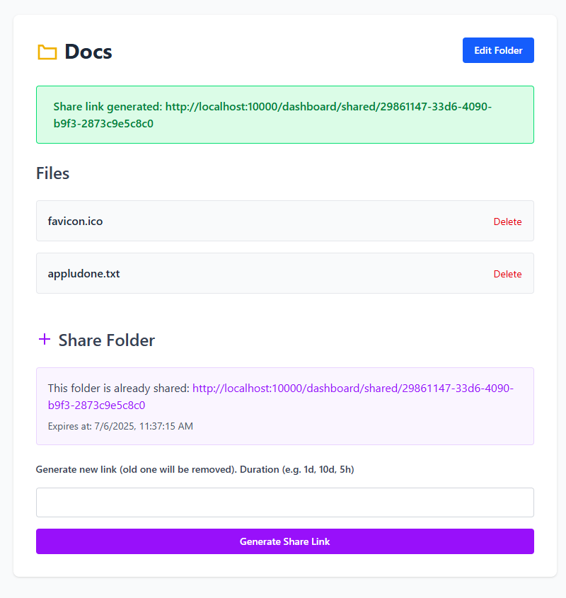
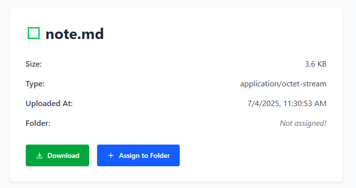

#  File Uploader (MyDrive)

> **A full-stack Node.js application for secure file storage, sharing, and folder management.**

---

##  Overview

**Project File Uploader** is a cloud-based file management system built with:

* **Node.js + Express** — Server-side logic and routing
* **Prisma ORM + PostgreSQL** — Robust, relational data modeling
* **Passport.js** — Secure user authentication
* **Tailwind CSS** — Clean, modern UI
* **Cloudinary** — Cloud storage for file uploads
* **EJS Templates** — Server-side rendering for dynamic pages

> Users can register, log in, upload files, organize them into folders, and share content with others through generated links.

---

##  Features

 **User Authentication**

* Register, login, and logout, reset password
* Session-based security with `express-session` and Passport

 **Folder & File Management**

* Create folders
* Upload files
* View and manage folder contents
* File details view

 **File Sharing**

* Generate unique shareable links for files or folders
* Share folders with specific users

 **Cloud Storage**

* Uploads stored securely in Cloudinary

 **Responsive UI**

* Tailwind CSS-based design
* Works across desktop and mobile

 **Error Handling**

* Flash messages for user feedback
* Global error pages

 **Security**

* Input validation with `express-validator`
* Environment-based configuration

---

##  Screenshots

## Dashboard
 

## Upload file
 

## Share Folder
 

## File Details
 

---

##  Tech Stack

| Tech              | Description                      |
| ----------------- | -------------------------------- |
| Node.js / Express | Server and routing               |
| Prisma ORM        | Database modeling and migrations |
| PostgreSQL        | Relational data storage          |
| Passport.js       | Authentication                   |
| Tailwind CSS      | Modern, responsive design        |
| Cloudinary        | Cloud-based media storage        |
| EJS Templates     | Server-side rendered views       |

---
